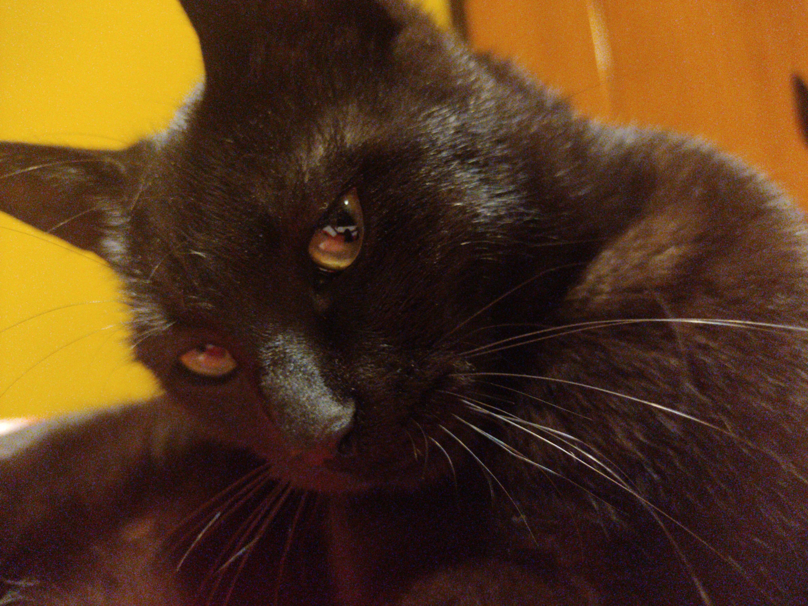

# DevSecOps Engineer and Open Source Evangelist

## Hello Friend.

I have a commitment to craft under the banner of Free and Open Source principles.
Embracing this ethos, I aim to foster an environment of collaboration and transparency 
empowering individuals and communities to build upon and enhance these creations without barriers.
**Given enough eyeballs, all bugs are shallow**.  

I can work under any versions of LGPL and GPL licenses.

## Topics I am covering

* DevOps
* Cyber Security

## Education

* Computer Engineering (I swear its fun -said nobody).
* self taught.

## Want to see my blog?

Visit [this](http://mario-pz.github.io/blog) link.

## Other
* [Twitch](https://www.twitch.tv/donavanstream)
* [Youtube](https://www.youtube.com/channel/UCV1O5JALSEN4RxBfkVHnEVA)
* Discord: @freedom_penguin

This is my puma.

これは私のピューマ猫です。
はい、私も日本語を勉強しています。

